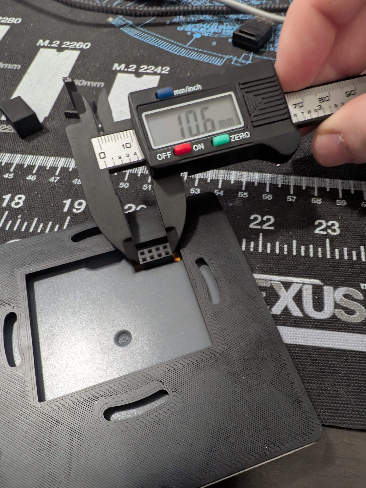
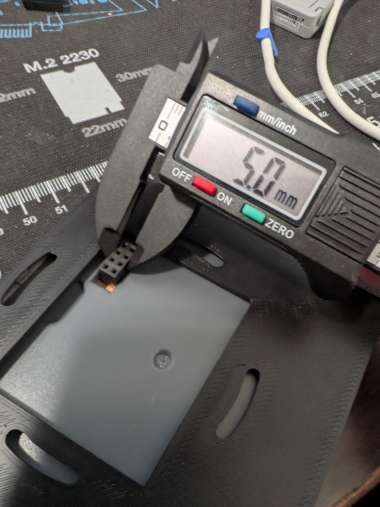

# IR Blaster — optional hardware mod

A plug-in **infrared emitter** driven from the panel's spare GPIO, so the
wall/desk-mounted ESP32-S3-4848S040 can also control IR gear (TV, AV receiver,
air conditioner, …) via Home Assistant.

The emitter electronics live **inside the desk-mount cradle** and expose a single
**3.5 mm mono jack** on the outside. A stick-on IR emitter cable plugs into the
jack and is positioned on (or near) the target device's IR window.

> **Status: design / sourcing.** The circuit and parts below are settled. One
> hardware item is still **unverified**: the exact pin assignment (which pin is
> 5 V vs GND vs signal) of the back-board 2×4 connector — see
> [Open items](#open-items). Confirm with a multimeter before powering anything.

## Why a transistor (and not GPIO-direct)

An ESP32-S3 GPIO outputs 3.3 V but is rated only ~20–40 mA. An IR LED hidden in
the cradle, firing across a room, wants **~100 mA pulsed** for usable range. So
the GPIO does not power the LED directly — it switches a small **transistor**,
and the LED draws its current from the **5 V rail**. IR is pulsed at low duty
(38 kHz carrier, brief bursts), so the LED tolerates the high current easily.

This board is also wired as a **power-distribution hub**: 5 V enters from a
USB-A pigtail, feeds the LED driver, and passes through to power the ESP.

## Circuit

```
USB-A 5V ──┬──────────────────────────── 5V out → ESP (passthrough)
           │
           └──[33 Ω]── 3.5 mm JACK tip ──→ (IR LED lives in the plug)
                            │
           collector ───────┘
            2N2222
GPIO 43 ──[1 kΩ]── base
            emitter ── GND ── 3.5 mm JACK sleeve
           │
USB-A GND ─┴──────────────────────────── GND (common, shared with ESP)
```

Key points:

- **Common ground is mandatory.** The ESP ground, the USB-A ground, and the
  transistor emitter must all be the same net, or the GPIO signal has no
  reference and nothing works.
- **The 33 Ω current-limit resistor stays on the board**, not in the plug. That
  makes any generic emitter cable safe, whether or not it has its own resistor.
- **Resistor value depends on the rail voltage:**
  - **5 V rail → 33 Ω** (≈ 100 mA pulsed)
  - **3.3 V rail → ~18 Ω** (if the connector turns out to be 3.3 V only)

## Signal GPIO

The RGB display consumes almost every pin on this board. Confirmed **free**
candidates for the IR signal:

| GPIO | Notes |
|------|-------|
| **43 / 44** | UART0 TX/RX. Free if serial-over-USB logging is disabled (log over the network instead). Preferred. |
| 1 / 2 / 40 | Onboard relay pins — usable **only if the relays are unused** in your build. |

### ESPHome snippet

```yaml
# Pin is provisional — set to the actual free GPIO you wire to (43/44 or a spare relay pin).
remote_transmitter:
  pin: GPIO43
  carrier_duty_percent: 50%
  # carrier_frequency is set per-transmit (typically 38 kHz)
```

Add `transmit_*` actions / buttons (or a `climate` IR component such as
`climate_ir_lg`, `coolix`, etc.) on top of this transmitter as needed.

## Learning codes from your remotes (IR receiver test)

To clone a SofaBaton (or any old remote), capture its codes with the **M5 IR
Unit's receiver** and read them out of the ESPHome logs, then replay them later
through the emitter.

**Wiring — M5 IR Unit (Grove HY2.0-4P) → panel:**

| IR Unit wire | Signal | Panel GPIO |
|--------------|--------|------------|
| Red | 5 V | 5 V |
| Black | GND | GND |
| White | IR_RX (receiver) | **GPIO43** |
| Yellow | IR_TX (emitter) | **GPIO44** *(for replay later)* |

GPIO43/44 are the only easily-free pins on this board — almost everything else
drives the RGB display (see `packages/board.yaml`). They're also the board's
**UART0 serial** pins, so **read the logs over WiFi** (ESPHome dashboard, or
`esphome logs <config>.yaml` over the network), not the USB serial monitor.

> The pin must be one the back-board 2×4 connector actually breaks out — still
> pending the multimeter pinout. If 43/44 aren't exposed there, use another free
> GPIO. (On an M5 Atom instead of the panel, the Grove pins are G26/G32.)

**Test YAML — add to the device config, `esphome compile`, flash:**

```yaml
# ── Logging tuned for reading IR captures ────────────────────────────
logger:
  level: DEBUG            # IR dumpers print at DEBUG
  baud_rate: 0            # disable UART0 logging → frees GPIO43/44 for IR;
                          # read logs over WiFi:  esphome logs <config>.yaml
  logs:
    remote_receiver: DEBUG  # keep IR loud …
    st7701s: WARN           # … and mute the chatty panel stack so the
    gt911: WARN             #     decoded IR lines are easy to spot
    light: WARN
    sensor: WARN

# ── IR receiver: capture + decode ────────────────────────────────────
remote_receiver:
  id: ir_rx
  pin:
    number: GPIO43
    inverted: true         # demodulating IR receivers idle HIGH, pull LOW on a burst
    mode:
      input: true
      pullup: true
  tolerance: 25%           # forgiving match for cheap remotes / SofaBaton
  buffer_size: 2kb         # headroom for long frames (A/C, macros)
  idle: 25ms
  dump:                    # named protocols → clean one-line decodes
    - nec
    - sony
    - samsung
    - panasonic
    - rc5
    - rc6
    - lg
    - jvc
    - pronto               # universal hex — paste straight into transmit_pronto
  # - raw                  # uncomment ONLY if a remote refuses to decode (very noisy)

# ── Emitter, ready to replay what you learned ────────────────────────
remote_transmitter:
  id: ir_tx
  pin: GPIO44
  carrier_duty_percent: 50%
```

Why this reads cleanly:

- **`baud_rate: 0`** turns off UART0 logging — that's what actually frees
  GPIO43/44 for IR. Logs then come over WiFi via `esphome logs`.
- **Curated `dump:` list** (named protocols, no `raw`) gives one tidy line per
  press — `Received NEC: address=0x20DF, command=0x10EF` — instead of a wall of
  microsecond timings. Add `- raw` back only when a remote won't decode.
- **`logs:` per-tag** keeps `remote_receiver` at DEBUG while muting the display
  /touch components, so each capture stands alone in the console.

**How to learn a command:**

1. Flash, then open the logs over WiFi.
2. Point the SofaBaton at the IR Unit (within ~30 cm) and press one button.
3. The log prints the decoded frame, e.g.
   `Received NEC: address=0x20DF, command=0x10EF` (or a `Pronto` / `raw` dump).
4. Drop that into a `remote_transmitter.transmit_nec:` (etc.) action to replay
   it. For protocols ESPHome can't name, copy the `raw` / `pronto` dump verbatim.

> CI note: `remote_receiver` / `remote_transmitter` aren't in the shipped
> firmware yet — this is a bench test. If it graduates to a real feature, wire it
> into a `tests/*.yaml` fixture so CI compiles the lambdas (see root `CLAUDE.md`).

## The back-board 2×4 connector

The panel's back board (power + relays) exposes an **8-pin, 2×4 connector**.
Measured with calipers (photos in [`images/`](images)):

| Dimension | Measured | Implies |
|-----------|----------|---------|
| Length (4-pin side) | **10.6 mm** | 4 × 2.54 mm ≈ 10.16 mm |
| Width (2-row side) | **5.0 mm** | 2 × 2.54 mm ≈ 5.08 mm |

→ Standard **2.54 mm / 0.1″ pitch 2×4** connector. The mating side is a common
2×4 0.1″ header / Dupont / IDC — easy to source.




> The photos confirm the **connector type and pitch**, not the **pinout**. Which
> of the 8 pins carries 5 V, GND, and usable GPIO must still be confirmed with a
> multimeter. See [Open items](#open-items).

## Bill of materials

| Part | Spec / search term | Qty | Link |
|------|--------------------|-----|------|
| IR emitter cable | Mlxkell 3.5 mm stick-on IR emitter, single head, 45°, 1.5 m (6-pack) | 1 pk | [amazon B0C46Q4555](https://www.amazon.com/dp/B0C46Q4555) |
| 3.5 mm mono jack | CESS 3.5 mm Mono **TS** panel-mount female socket, solder tabs (4-pack) | 1 pk | [amazon B017CBO4MO](https://www.amazon.com/dp/B017CBO4MO) |
| Transistor | `2N2222` NPN (or `BC547`, or `2N7002` MOSFET) | 1 | — |
| LED resistor | 33 Ω ¼ W (use ~18 Ω if rail is 3.3 V) | 1 | — |
| Base resistor | 1 kΩ ¼ W | 1 | — |
| 5 V input cable | USB-A male → bare-wire power pigtail (red = +5 V, black = GND) | 1 | — |
| 2×4 mating connector | 2.54 mm 0.1″ 2×4 header / Dupont / IDC | 1 | — |
| Perfboard | prototype PCB / stripboard | 1 | — |
| Hookup wire | 24–26 AWG stranded | — | — |
| Heat-shrink | assorted small | — | — |

**Tools:** soldering iron + solder, wire strippers / flush cutters, and a
**multimeter** (used to confirm the connector's 5 V vs GND pins before powering).

A custom PCB is optional — for a circuit this small, perfboard or an inline
("dead-bug") build is perfectly adequate. If you do want a fabricated board,
EasyEDA (browser-based, tied to JLCPCB) is the lowest-friction first option.

## Assembly notes

1. Wire the jack: **tip → 33 Ω / transistor collector leg**, **sleeve → GND**.
2. Share ground across USB-A, ESP, and the transistor emitter.
3. **Polarity test:** plug in the emitter and transmit. A working IR LED glows
   faint purple in a phone camera. If dark, flip the tip/sleeve wiring once.
4. **Do not double-power:** when feeding 5 V via the USB-A pigtail, don't also
   plug the board's own USB-C in — pick one 5 V source.

## Open items

- [ ] **Confirm the 2×4 pinout** — multimeter which pins are **5 V**, **GND**,
      and any usable **GPIO**. (Photos give connector type only.)
- [ ] **Confirm rail voltage** — is the power pin **5 V** or **3.3 V**? Decides
      the LED resistor (33 Ω vs ~18 Ω) and whether the board can be powered from
      that connector at all.
- [ ] **Pick + wire the signal GPIO** (43/44 or a spare relay pin) and add the
      `remote_transmitter` config to the firmware.
